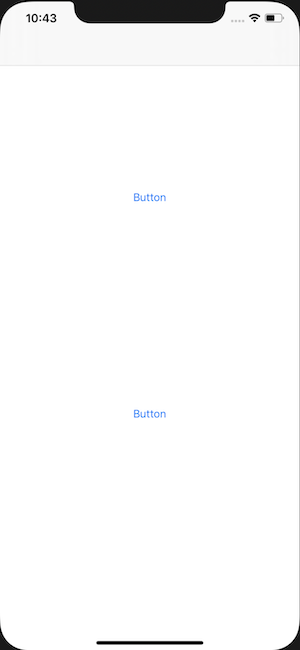
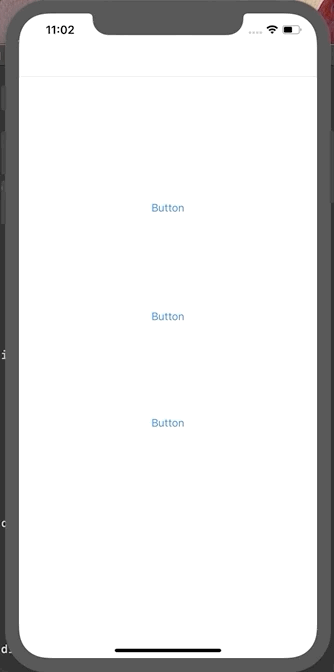

# UIKitAnimationDemo

Best animation demo ever! (This is a demo on how to create a README.md file for personal repositories on GitHub)

```swift 
func challengeFunc() {
  // code here
  let name = "Brendon Cecilio"
}
```

## Screenshot of app



## GIF


